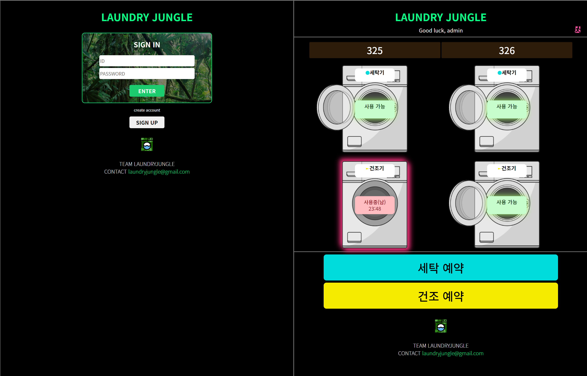

# laundry-jungle

## 개요

- 사이트 주소: [laundry-jungle.com](http://laundry-jungle.com)

- KRAFTON Jungle 교육 기간 중, 다른 층에 위치한 세탁기의 현황을 사용자들 끼리 편하게 공유하여
    직접 **확인하는 불편을 해소**하기 위한 서비스
- 해당 서비스로 해결하고자 한 점
    - 다른 층에 위치한 세탁기가 비었는 지 직접 확인해야 하는 문제
    - 타인의 세탁물이 남아있을 때 대처 문제

## 결과

> 자료: 네이버 클라우드 플랫폼 메시지 사용 기록*

| 사용월 | 10월  | 11월 | 12월 |  1월  |  2월  | 3월(~15일) |
| :----: | :---: | :--: | :--: | :---: | :---: | :--------: |
| 사용량 | 164건 |  -   | 87건 | 152건 | 117건 |    44건    |

- 12월부터 4달 동안 교육생 24명이 400건 이상 사용(10월 테스트 기간 제외)하는 서비스 제공

## 기간

**2022-10-24 ~ 2022-10-27**

- 24일: 아이디어 회의
- 25일: 서버 및 프론트엔드 기능 구현
- 26일: UX를 위한 UI 개선, 예외 테스트 및 처리
- 27일: 서비스 발표

## 기능구현

1. 회원가입 및 로그인
    - **Mongo DB**를 사용한 DB 구성을 통해 유저 관리
2. **Advanced Python Scheduler**를 활용한 서비스 관리
    1. 문자 발송 서비스
        - 네이버 클라우드 플랫폼API를 활용한 문자 발송 서비스
        - 사용자에게 상황에 따라 적절한 문자 발송
    2. 로그 관리
        - 월 단위로 기록되는 사용자 로그 기능 구현
